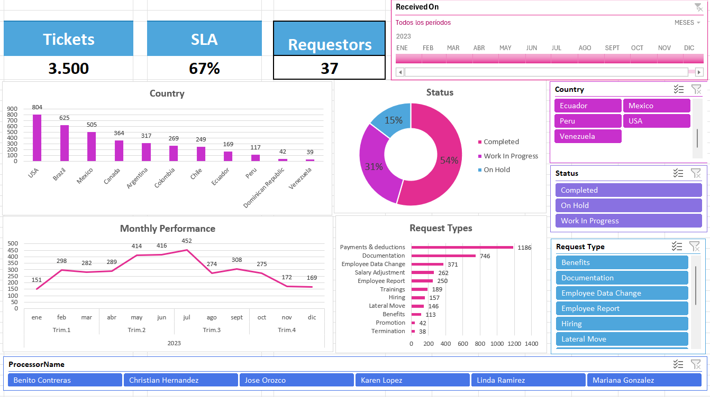

# HR Service Requests Dashboard – Microsoft Excel

## Descripción

Este proyecto consiste en el desarrollo de un dashboard interactivo en Microsoft Excel para el análisis de solicitudes de Recursos Humanos (HR Service Requests).

El objetivo del dashboard es facilitar el monitoreo de indicadores clave (KPIs) y permitir el análisis de la información mediante filtros interactivos, ayudando a identificar tendencias, distribución geográfica de solicitudes y estado de los tickets.

## Objetivos

- Visualizar indicadores clave de desempeño (KPIs).
- Analizar el volumen de solicitudes por país.
- Monitorear el estado de los tickets.
- Identificar los tipos de solicitudes más frecuentes.
- Analizar la evolución mensual de las solicitudes.
- Permitir la exploración interactiva de la información mediante filtros.

## Herramientas utilizadas

- Microsoft Excel
- Modelo de Datos (Data Model / Power Pivot)
- Tablas Dinámicas
- Gráficos Dinámicos
- Segmentadores de Datos (Slicers)
- Línea de Tiempo (Timeline)

## Indicadores principales

- Total de Tickets
- Cumplimiento de SLA
- Número de Solicitantes

## Visualizaciones

El dashboard incluye las siguientes visualizaciones:

- Tickets por país
- Estado de los tickets
- Rendimiento mensual
- Tipos de solicitudes

Todas las visualizaciones son interactivas y responden a los filtros aplicados por el usuario.

## Filtros disponibles

El dashboard permite analizar la información mediante:

- País
- Estado del ticket
- Tipo de solicitud
- Procesador responsable
- Línea de tiempo por meses

## Organización del archivo

El libro de Excel está organizado en distintas hojas para mantener una estructura clara:

- **Datos:** contiene el conjunto de datos utilizado para el análisis.
- **Dashboard:** panel principal con las visualizaciones e indicadores.
- **Tablas dinámicas:** hojas ocultas utilizadas como origen de los gráficos dinámicos, con el fin de mantener una interfaz limpia para el usuario.

## Modelo de datos

Las tablas dinámicas fueron creadas utilizando el **Modelo de Datos de Excel (Power Pivot)**. En este proyecto, los datos se cargaron al modelo para aprovechar funcionalidades disponibles únicamente en este entorno, como el **recuento distinto (Distinct Count)**, utilizado para calcular el número único de solicitantes (Requestors) y otros indicadores del dashboard.
